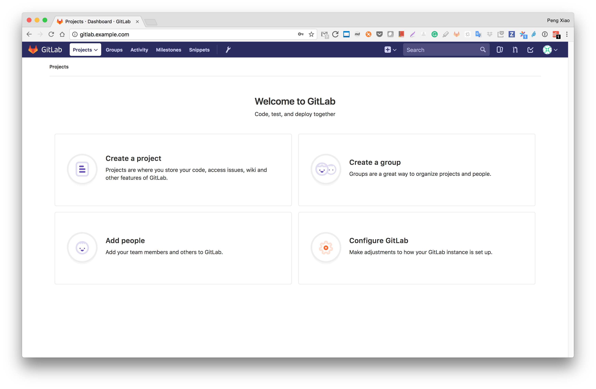

# GitLab Server 的搭建

[参考](https://about.gitlab.com/installation)

## 1. 准备工作

以Centos7为例，准备一台至少内存为4G的机器。

## 2. 安装依赖软件

```shell
sudo yum install -y git vim gcc glibc-static telnet
sudo yum install -y curl policycoreutils-python openssh-server
sudo systemctl enable sshd
sudo systemctl start sshd

sudo yum install postfix
sudo systemctl enable postfix
sudo systemctl start postfix
```

## 3. 设置gitlab安装源

如果在国内的话，可以尝试使用清华大学的源。

新建 /etc/yum.repos.d/gitlab-ce.repo，内容为

```shell
[gitlab-ce]
name=Gitlab CE Repository
baseurl=https://mirrors.tuna.tsinghua.edu.cn/gitlab-ce/yum/el$releasever/
gpgcheck=0
enabled=1
```

如果在国外的话，可以使用

```shell
curl https://packages.gitlab.com/install/repositories/gitlab/gitlab-ee/script.rpm.sh | sudo bash
```

## 4. 安装GitLab

关于域名，如果要是设置域名，则如下，这个域名可以是真实购买的域名，如果您要把gitlab安装到公网比如阿里云上的话。

如果只是想本地测试，则可以像下面一样，设置一个example的域名，然后记得在本地你的笔记本设置host，如果是MAC就在 /etc/hosts里添加 一行 `192.168.211.10 gitlab.example.com`  

```shell
sudo EXTERNAL_URL="http://gitlab.example.com" yum install -y gitlab-ce
```

如果不想设置域名，或者想将来再考虑，可以直接

```shell
sudo yum install -y gitlab-ce
```

安装完成以后，运行下面的命令进行配置

```shell
sudo gitlab-ctl reconfigure
```

## 5. 登陆和修改密码

打开[访问域名](http://gitlab.example.com/) 修改root用户密码，然后使用root和新密码登陆。



root/leon4743
